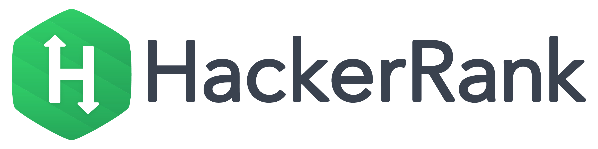

# HackerRank Solutions Repository



Welcome to my HackerRank Solutions Repository! This repository contains my solutions to various problems on HackerRank, organized by categories and subdomains. Whether you're a fellow programmer seeking inspiration or someone looking to improve their problem-solving skills, I hope you find this repository helpful.

## Structure

The repository is organized into directories, each corresponding to a different category or subdomain on HackerRank. Within each directory, you will find solutions implemented in various programming languages. The structure is designed to make it easy for you to navigate and locate solutions based on your interests or needs.

## Languages

Solutions are provided in multiple programming languages, allowing you to choose the language you are most comfortable with or interested in learning. The languages currently included are:

- Python
- Java
- JavaScript
- and more...

## How to Use

Feel free to explore the repository, dive into specific categories, and examine the solutions in your preferred programming language. Each solution is contained within its own directory, named intuitively to help you quickly identify the corresponding HackerRank problem.

If you find any issues with the solutions or have suggestions for improvements, please don't hesitate to open an issue or submit a pull request. Your contributions are highly appreciated!

Happy coding!

Kuray Karaaslan
